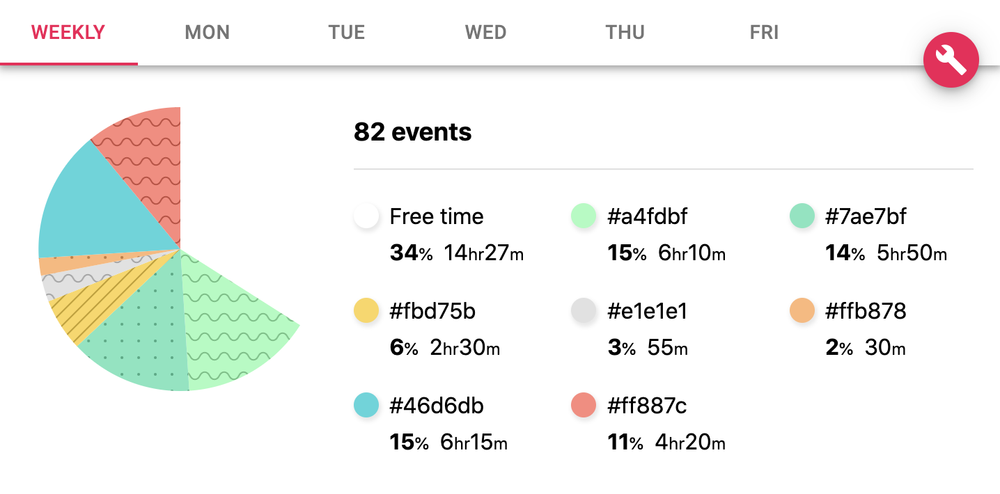

<h2 align="center">GCal Eval</h2>

  
   
  <i>A Chrome plugin to analyse your work week at a glance</i>

## Overview

This plugin uses the _colours_ of your diary to analyse the time spent on different things.

At a glance, see how many interviews you're in, how many 1-1s you have and how much free time you have as a result.

## Installation

### Chrome

1. Download this project
2. Go to <kbd>chrome://extensions</kbd> in a web browser
4. Drag the <kbd>gcal_eval-0.0.1.zip</kbd> file in the <kbd>chrome</kbd> folder into the page

### Firefox

1. Download this project
2. Go to <kbd>about:addons</kbd> in a web browser
4. Drag the <kbd>gcal_eval-0.0.1.zip</kbd> file in the <kbd>chrome</kbd> folder into the page

## Next steps

- [ ] Deal with clashing meetings
- [ ] Publish on web stores
- [ ] Highlight your work day
